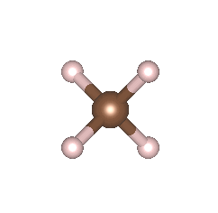

# C++ Quantum Chemistry Implementation

This project is a C++ implementation of self-consistent field (SCF) calculations from scratch for educational purpose. Within this package we can directly see how the density matrix is initialize and converged. The evolution of electron density at each step of SCF is calculated and visualized. 



## Completed Functionality

The current version of the project includes the following features:

- **SCF Convergence:** Iterative self-consistent field (SCF) calculations with convergence criteria.
    Different initialization of Density Matrix (D_m) 
    - random initialized
    - initialize at zero 
    - use core Hamiltonian as initial guess of Fock Matrix 

- **MP2 perturbation energy:** transform AO basis to MO basis and compute MP2 energy. 

## TODO: Work-in-Progress

The project is actively being developed, and the following features are planned for implementation:

- [ ] Geometry Optimization

- [ ] Density Functional Theory (DFT) 

- [ ] Parallelization

- [ ] Improved Input/Output

- [ ] Documentation

## Getting Started

To build and run the project, follow these steps:

1. Clone the repository:

   ```bash
   git clone git@github.com:chuhong-wang/Hartree-Fork.git
   cd Hartree-Fork 

2. build the project:
    mkdir build
    cd build
    cmake ..
    make

3. Run an example
    TODO 

